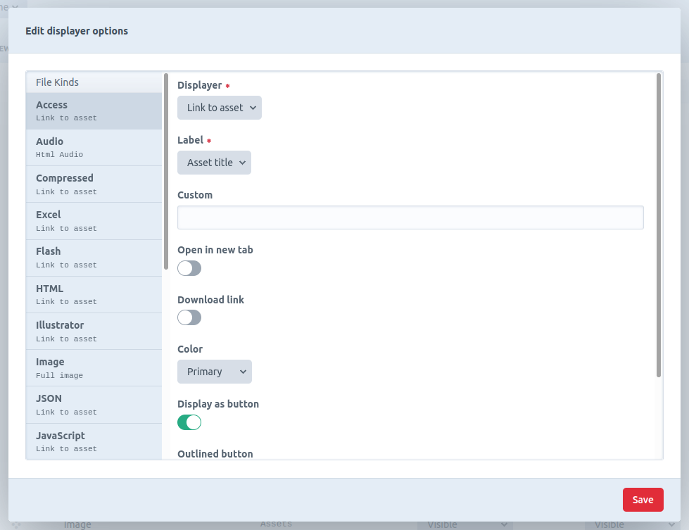
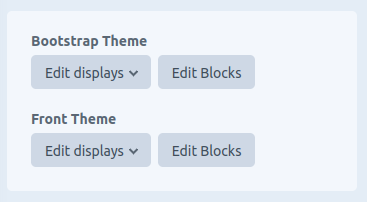

# Craft themes (v3.x)

Version 3 has brought the pro version which is a big change from the v2 version. You can always use the v3 lite version which is very similar to v2 (make sure you check the breaking changes in the [developers readme](DEVELOPERS.md)) with a few other small changes.

The pro version aims at taking control over how pages are displayed using an interface in the backend and a theme engine that is reusable, adaptable and easy to use.  
Themes are regular Craft plugins, as such they can be shared on the store, installed from packagist or created by yourself. They can have settings and migrations and most importantly extend each other.  
Craft backend is amazing but if you're not a developer making a frontend can be a bit daunting, the pro version should alleviate this by doing a lot of the work for you.

The lite version will allow you to :
- Install themes from the store or any git repository (composer, github etc)
- Define your own themes that can extend each other
- Choose which theme will be used for which site, language, viewport or url path according to a set of rules.

The Pro version will allow you to :
- Define regions in your themes
- Assign blocks to the themes regions
- Define your own blocks
- Define your own view modes for each entry types/category groups/global sets/tag groups/volumes/users layouts
- Choose how your fields and assets are displayed on the front end depending on their view modes and options
- Define your own fields and assets displayers
- Use a templating cascading system that allows bespoke rendering
- Eager load fields automatically
- Use several caching layers for faster rendering

What it doesn't allow you to do :
- Change the backend look and feel
- Override plugins templates (unless specific case, see [developers readme](DEVELOPERS.md#root-templates-folder))

## Themes list


The Menu item Theming -> Themes displays the list of themes installed on the system and some shortcut links.

## Rules


Define rules in the settings to load the theme you want according to 4 parameters :
- the current site
- the current language
- the current view port
- the current url path, this can also be a regular expression if enclosed in slashes. example `/^blog*/`. Enter `/` for the homepage.

The first rule that match will define which theme will be used. Organise your rules to have the most specific first.

If no rules match, the default theme will be used.

If no default is set, the theme engine will just not be used and your templates will be loaded from the root templates folder.

### Console/CP requests

If you have templates requested during a CP or Console request for the site mode (`View::TEMPLATE_MODE_SITE`), you must set the Console/CP themes in the rules section if you want your theme to takeover those templates. A good example for that would be emails sent when using the backend or during a queue.  
On Craft pro you can specify the setting 'HTML Email Template', this template won't be found in your theme unless the CP requests theme has been set in your rules.

## Basic notions (Pro)

The building of a page is based on the notion of layouts, regions, blocks, view modes and displays (or groups of displays).

**Layouts** are automatically created by the system as you create/delete entry types and anything that can have fields or urls, there are 8 types of layouts :

| Layout type | Associated with | Can have blocks | Can have displays and view modes |
|-------------|-----------------|-----------------|----------------------------------|
| Default     |                 | Yes             | No                               |
| Category    | Category group  | Yes             | Yes                              |
| Entry       | Entry type      | Yes             | Yes                              |
| Global      | Global set      | No              | Yes                              |
| Tag         | Tag group       | No              | Yes                              |
| User        | User            | No              | Yes                              |
| Volume      | Volume          | No              | Yes                              |
| Custom      |                 | Yes             | No                               |

Custom layouts will have to be rendered manually in your templates.

**Regions** they are defined by the theme itself, blocks can be assigned to them.

**Blocks** are defined on the layouts that allow them, they can be assigned to a region of the theme.

**Displays** define how fields and assets are rendered on the front end, each field/asset will have a displayer with some options. This plugin comes with default displayers for each type of craft field and each kind of asset. Displays can be organised in groups.

**View modes** define a set of displayers and options for a layout and a view mode. Every Layout that can have view modes comes with a default one. This allows you to render an element differently in different parts of the page.

This theme engine comes with default blocks and field/asset displayers, that might not fit your needs. To learn how to define new blocks, field and asset displayers, see the [developers readme](DEVELOPERS.md)

## Blocks (Pro)


The Menu item Theming -> Blocks allows you to drag and drop blocks into the different regions of your Themes. 

Define your blocks for the default layout, from which blocks will be pulled for every layout that doesn't have blocks defined. If you need a different set of blocks for other layouts, you can copy the current layout into another type of layout.

This plugins comes with the following type of blocks :

- Category : choose a category and a view mode to render
- Content : Main content of the page, should be present on each layout
- Current user : Display information about the current user
- Entry : Choose a entry and a view mode to render
- Global : Choose a global set and a view mode to render
- Messages : Renders the session messages stored in 'notice' and 'error' session flash data
- Site name : Displays the site name
- Template : Renders a custom template
- Twig : Renders some custom twig code
- User : Choose a user and a view mode to render
- Login form
- Profile form
- Register form
- Reset password form
- Search form
- Set password form

### Project config

Blocks will be included in the project config, but for the blocks that reference an element the information will not be saved in the project config (because elements are different from an environment to another), those are : Entry, Category and User. Those blocks will need to be resaved in the new environment they are deployed to, to reference the correct element.

## Displays (Pro)


The menu item Theming -> display allows you to define new view modes for your layouts and select the displayers for your fields.

Choose the theme (if you have several) on the top left hand side, the layout on the left menu, and the view mode tab.

Displays will be saved in project config.

Displays can be grouped together, you can define as many groups as you want. Groups cannot contain groups.

Some display will contain items that are not Craft fields, they are automatically added by the system, example : "Author" on channels.

Some fields types (Entries, Assets, Users, Categories and Tags) support the display "Rendered as view mode", when this is selected the display of that element's fields will be controlled by the layout associated to that element and the view mode chosen.

Here is a list of available displayers for each type of field :

| Field type    | displayer                  | Options                                          |
|---------------|----------------------------|--------------------------------------------------|
| Title         | Title                      | html tag, linked to element                      |
| Assets        | Links                      | Label, new tab, download                         |
| Assets        | Rendered (volume layout)   | View mode                                        |
| Assets        | Render file                | Various options for each kind of file, see below |
| Assets        | Slick Carousel             | View mode, most of slick options                 |
| Category      | Label                      |                                                  |
| Category      | Links                      | Label, new tab                                   |
| Category      | Rendered (category layout) | View mode                                        |
| Category      | Slick Carousel             | View mode, most of slick options                 |
| Checkboxes    | Label                      |                                                  |
| Colour        | Default                    |                                                  |
| Date          | Date                       | Predefined or custom format                      |
| Date          | Date and time              | Predefined or custom format                      |
| Date          | Time ago                   |                                                  |
| Dropdown      | Label                      |                                                  |
| Email         | Email                      | Output as link                                   |
| Entries       | Links                      | Label, new tab                                   |
| Entries       | Rendered (entry layout)    | View mode                                        |
| Entries       | Slick Carousel             | View mode, most of slick options                 |
| Matrix        | Default                    |                                                  |
| Matrix        | Slick Carousel             | Most of slick options                            |
| Multi select  | Label                      |                                                  |
| Number        | Default                    | Decimals, Show prefix/suffix                     |
| Plain text    | Full                       |                                                  |
| Plain text    | Truncated                  | Limit, ellipsis, link to entry                   |
| Radio buttons | Label                      |                                                  |
| Lightswitch   | Label                      |                                                  |
| Table         | Default                    |                                                  |
| Tag           | Label                      |                                                  |
| Tag           | Rendered (tag layout)      | View mode                                        |
| Tag           | Slick Carousel             | View mode, most of slick options                 |
| Time          | Time                       | Predefined or custom format                      |
| Url           | Link                       | New tab, label                                   |
| Users         | Default                    | Show firstname/surname/email, link email         |
| Users         | Rendered (user layout)     | View mode                                        |
| Users         | Slick Carousel             | View mode, most of slick options                 |

And a list of available file displayers, those will be chosen when editing a field that handles assets :

| File type  | displayer       | Options                                       |
|------------|-----------------|-----------------------------------------------|
| Audio      | Html audio      | Show controls, muted, autoplay                |
| HTML       | Iframe          | Width, height                                 |
| HTML       | Raw             |                                               |
| HTML       | Code            |                                               |
| image      | Full image      |                                               |
| Image      | Image transform | Transform or custom, sizes (srcset)           |
| Javascript | Raw             |                                               |
| Javascript | Code            |                                               |
| PHP        | Raw             |                                               |
| PHP        | Code            |                                               |
| JSON       | Raw             |                                               |
| JSON       | Code            |                                               |
| Text       | Raw             |                                               |
| Text       | Code            |                                               |
| Video      | HTML Video      | Width, height, show controls, muted, autoplay |
| XML        | Raw             |                                               |
| XML        | Code            |                                               |



Every file type will also have the displayer "Link to asset" available, with options label, new tab and download.

## Partial themes

A partial theme will not be available to select in the backend, but it can be inherited from. You will see them in the themes list, but won't be able to define blocks/displays for them.

## User Preferences (Pro)

You'll find two new user preferences :
- Show templates suggestions and available variables on the front end (this will be off on production environments no matter what)
- Show some shortcuts on layouts for quick links to edit elements and layouts

## Control Panel shortcuts (pro)

If enabled in the settings (enabled by default) you will see some shortcuts (displays and blocks) on element edit pages (entries, users, assets, globals, categories) :



## Caching

There are several layers of caching in this plugin, which should all be enabled on production environments for faster execution :
- Template resolution cache, helps loading the correct templates faster.
- Eager loading cache, keep in cache view mode eager loading maps.
- Rules cache, keeps in cache which theme to use for which url
- Displayer cache, see below
- Block cache, see below

### Displayer cache

Displayers html output can be stored in cache for faster execution.

The content block caching strategy controls the displayer cache, it really shouldn't use the "Global" strategy, or the fields on the same pages will display the same content.  
Setting no cache strategy to the content block will effectively disable the displayer cache.

Displayer caching uses Craft internal cache tagging system so cache will be automatically invalidated when displayers/fields/view modes are changed.

### Block cache

You can choose a cache strategy for each block which defines how the block is cached. This plugin comes with 3 strategies :

- Global : Will cache the same block for all urls
- Url path : Will cache separately or each url path
- Url path (with query) : Same as above but will also look at the query string

Each of those strategies can be set to cache differently whether the user is logged in or out, or cache differently for each logged in user or their view ports (mobile, tablet or desktop).  
Block caching uses Craft internal cache tagging system so cache will be automatically invalidated when elements used within a block are changed.

## Scss

This plugin has an integrated Php Scss compiler allowing you to define scss asset bundles or compile scss directly in your templates.  
See the [Developers documentation](DEVELOPERS.md#scss-compiling) for usage.

## Console commands

`craft invalidate-tags/themes::blocks` : Clears all block cache  
`craft invalidate-tags/themes::rules` : Clears rules cache  
`craft invalidate-tags/themes::displayers` : Clears displayers cache  
`craft invalidate-tags/themes::eagerLoad` : Clears eager loading maps cache  
`craft invalidate-tags/themes::templates` : Clears templates resolution cache  
`craft themes/install` : Reinstall all themes data (layouts etc)

Classes creation :  
`craft themes/create/theme` : Creates a new theme  
`craft themes/create/block` : Creates a new block for a theme  
`craft themes/create/block-provider` : Creates a new block provider class for a theme  
`craft themes/create/field-displayer` : Creates a new field displayer for a theme  
`craft themes/create/file-displayer` : Creates a new file displayer for a theme  

Scss :
`craft clear-caches/themes-scss-cache` : Clear inline (templates) scss cache
`craft themes/scss/compile theme-handle src-file dest-file` : Compile a scss file

## Installation

- run `composer require ryssbowh/craft-themes:^3.0` and install plugin
- Add the theme installer module to `config/app.php` :
```
use Ryssbowh\CraftThemes\Installer;

return [
    'modules' => [
        'theme-installer' => Installer::class
    ],
    'bootstrap' => ['theme-installer'],
];
```
- Install/Create a theme
- Add a rule in the settings to load a theme or set a default theme.
- If you're using the Pro version, your Sections/Category group templates should extend or look like [themed_page](src/templates/front/themed_page.twig) and render your theme's regions

Uninstalling this plugin will uninstall all themes.  
Disabling this plugin will disable all themes.  
Installing a theme that extends another will automatically install that other theme.  
Installing a theme will automatically install this plugin.  
Disabling a theme will disable all theme that extend from it.  
Uninstalling a theme will permanently delete all its blocks/displays/layouts (Pro version only).

## Requirements

Craft 3.7.*  
PHP 7.3 or over
PHP Intl extension

## Testing

This plugin is unit tested with mysql 5.7, postgresql 12.8, Craft 3.7 and php 7.3, 7.4 and 8.0.

## Documentation

- [Class reference](https://ryssbowh.github.io/craft-themes/namespaces/ryssbowh-craftthemes.html) (from 3.0.0 only)
- [Developers readme](DEVELOPERS.md)
- 1.x documentation [there](README1.md)
- 2.x documentation [there](README2.md)

## Roadmap/Ideas

- Themes preferences not related to project config
- Restricted version of blocks page for envs where admin changes are disabled
- Improve displayer cache by not saving the ones that didn't change
- Add a Theme tab to the debug bar