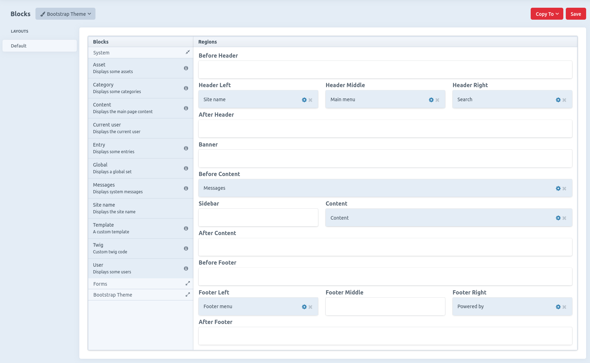
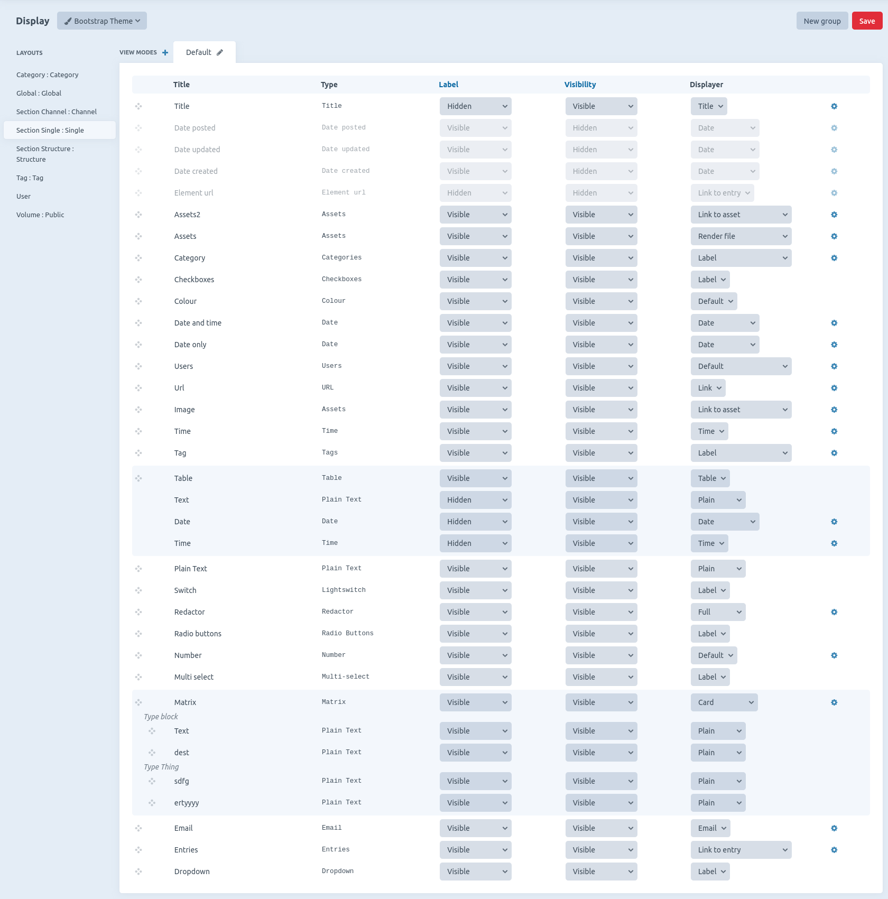

# Craft themes

### This is the 3.x documentation
### Find the developers readme [there](DEVELOPERS.md)

Tired of re-making your front-ends all over again when a lot of it could be reused ? 
A theme is just another Craft plugin, it can inherit another theme and has the same functions as any other plugin, settings, migrations etc. 

This Theme engine allows you to :
- Install themes from the store or any git repository (composer, github etc)
- Define your own themes that can extend each other
- Choose which theme will be used for which site, language, viewport or url path according to a set of rules.

The Pro version will allow you to :
- Assign blocks to your theme regions
- Define your own blocks
- Cache your blocks
- Define your own view modes for each entry types/category groups/global sets/tag groups/volumes/users layouts
- Choose how your fields and assets are displayed on the front end depending on their view modes
- Define your own fields and assets displayers

What it doesn't allow you to do :
- Change the backend look and feel
- Override plugins templates (unless specific case, see developers readme)

## Basic notions

The building of a page is based on the notion of layouts, regions, blocks, view modes and displays (or groups of displays).

**Layouts** are automatically created by the system as you create/delete entry types and anything that can have fields or urls, there are 7 types of layouts :

| Layout type | Associated with | Can have blocks | Can have displays and view modes |
|-------------|-----------------|-----------------|----------------------------------|
| Default     |                 | Yes             | No                               |
| Category    | Category group  | Yes             | Yes                              |
| Entry       | Entry type      | Yes             | Yes                              |
| Global      | Global set      | No              | Yes                              |
| Tag         | Tag group       | No              | Yes                              |
| User        | User            | No              | Yes                              |
| Volume      | Volume          | No              | Yes                              |

**Regions** they are defined by the theme itself, blocks can be assigned to them.

**Blocks** are defined on the layouts that allow them, they can be assigned to a region of the theme.

**Displays** define how fields and assets are rendered on the front end, each field/asset will have a displayer with some options. This plugin comes with default displayers for each type of craft field and each kind of asset. Displays can be organised in groups.

**View modes** define a set of displayers and options for a layout and a view mode. Every Layout that can have view modes comes with a default one. This allows you to render an element differently in different parts of the page.

For a layout to be rendered on the front end when visiting a url, its associated element (Section, Category etc) must define its template to `themed_page`, or the block/displayer engines will be skipped entirely.

This theme engine comes with default blocks and field/asset displayers, that might not fit your needs. To learn how to define new blocks, field and asset displayers, see the [developers readme](DEVELOPERS.md)

## Themes list

The Menu item Theming -> Themes displays the list of themes installed on the system and some shortcut links.

## Blocks

The Menu item Theming -> Blocks allows you to drag and drop blocks into the different regions of your Themes. 

Define your blocks for the default layout, from which blocks will be pulled for every layout that doesn't have blocks defined. If you need a different set of blocks for other layouts, you can copy the current layout into another type of layout.

This plugins comes with the following type of blocks :

- Category : choose a category and a view mode to render
- Content : Main content of the page, should be present on each layout
- Current user : Display information about the current user
- Entry : Choose a entry and a view mode to render
- Global : Choose a global set and a view mode to render
- Messages : Renders the session messages stored in 'notice' and 'error' session flash data
- Site name : Displays the site name
- Template : Renders a custom template
- Twig : Renders some custom twig code
- User : Choose a user and a view mode to render

### Project config

Blocks will be included in the project config, but for the blocks that reference an element the information will not be saved in the project config (because elements are different from an environment to another), those are : Entry, Category and User. Those blocks will need to be resaved in the new environment they are deployed to, to reference the correct element.

### Caching

You can choose a cache strategy for each block which defines how the block is cached. This plugin comes with 3 strategies :

- Global : Will cache the same block for all urls
- Url path : Will cache separately or each url path
- Url path (with query) : Same as above but will also look at the query string

Each of those strategies can be set to cache differently whether the user is logged in or out, or cache differently for each logged in user.  
Block caching uses Craft internal cache tagging system so cache will be automatically invalidated when elements used within a block are changed.

## Displays

The menu item Theming -> display allows you to define new view modes for your layouts and select the displayers for your fields.

Choose the theme (if you have several) on the top left hand side, the layout on the left menu, and the view mode tab.

Displays will be saved in project config.

Displays can be grouped together, you can define as many groups as you want. Groups cannot contain groups.

Some display will contain items that are not Craft fields, they are automatically added by the system, example : "Author" on channels.

Here is a list of available displayers for each type of field :

| Field type    | displayer                  | Options                                          |
|---------------|----------------------------|--------------------------------------------------|
| Title         | Default                    | html tag, linked to element                      |
| Assets        | Link to asset              | Label, new tab, download                         |
| Assets        | Rendered (volume layout)   | View mode                                        |
| Assets        | Render file                | Various options for each kind of file, see below |
| Category      | List                       | Output as links                                  |
| Category      | Rendered (category layout) | View mode                                        |
| Checkboxes    | Default                    |                                                  |
| Colour        | Default                    |                                                  |
| Date          | Default                    | Format                                           |
| Dropdown      | Default                    |                                                  |
| Email         | Default                    | Output as link                                   |
| Entries       | Link to entry              | Label, new tab                                   |
| Entries       | Rendered (entry layout)    | View mode                                        |
| Matrix        | Default                    |                                                  |
| Multi select  | Default                    |                                                  |
| Number        | Default                    | Decimals, Show prefix/suffix                     |
| Plain text    | Full                       |                                                  |
| Plain text    | Truncated                  | Limit, ellipsis, link to entry                   |
| Radio buttons | Default                    |                                                  |
| Lightswitch   | Default                    |                                                  |
| Table         | Default                    |                                                  |
| Tag           | List                       |                                                  |
| Tag           | Rendered (tag layout)      | View mode                                        |
| Time          | Default                    | Format                                           |
| Url           | Default                    | New tab, label                                   |
| Users         | Default                    | Show firstname/surname/email, link email         |
| Users         | Rendered (user layout)     | View mode                                        |

And a list of available file displayers :  
Every file type will also have the displayer "Link to asset" available, with options label, new tab and download.

| File type  | displayer       | Options                                       |
|------------|-----------------|-----------------------------------------------|
| Audio      | Html audio      | Show controls, muted, autoplay                |
| HTML       | Iframe          | Width, height                                 |
| HTML       | Raw             |                                               |
| HTML       | Code            |                                               |
| image      | Full image      |                                               |
| Image      | Image transform | Transform or custom                           |
| Javascript | Raw             |                                               |
| Javascript | Code            |                                               |
| PHP        | Raw             |                                               |
| PHP        | Code            |                                               |
| JSON       | Raw             |                                               |
| JSON       | Code            |                                               |
| Text       | Raw             |                                               |
| Text       | Code            |                                               |
| Video      | HTML Video      | Width, height, show controls, muted, autoplay |
| XML        | Raw             |                                               |
| XML        | Code            |                                               |

## Rules settings

Define rules in the settings to load the theme you want according to 4 parameters :
- the current site
- the current language
- the current view port
- the current url path, this can also be a regular expression if enclosed in slashes. example `/^blog*/`. Enter `/` for the homepage.

The first rule that match will define which theme will be used. Organise your rules to have the most specific first.

If no rules match, the default theme will be used.

If no default is set, the theme engine will just not be used and your templates will be loaded from the root templates folder.

You can also define there which theme should be used for console requests, this can be useful when you have commands rendering templates.

## Partial themes

A partial theme will not be available to select in the backend, but it can be inherited from. You will see them in the themes list, but won't be able to define blocks/displays for them.

## Console/CP requests

If you have templates requested during a CP or Console request for the site mode (`View::TEMPLATE_MODE_SITE`), you must set the Console/CP themes in the rules section if you want your theme to takeover those templates. A good example for that would be emails sent when using the backend or during a queue.  
On Craft pro you can specify the setting 'HTML Email Template', this template won't be found in your theme unless the CP requests theme has been set in your rules.

## Installation

- run `composer require ryssbowh/craft-themes:^3.0`
- Activate plugin
- Go to the settings and install the themes data
- Add a rule in the settings to load a theme or set a default theme.
- Set your templates to `themed_page` for section/categories you want to use the theme engine for

Uninstalling this plugin will uninstall all themes.

## Requirements

Craft 3.5 or over

## Previous documentations

- 1.x documentation [there](README1.md)
- 2.x documentation [there](README2.md)

## Roadmap

- tests
- translations
- custom layouts
- deployment/config